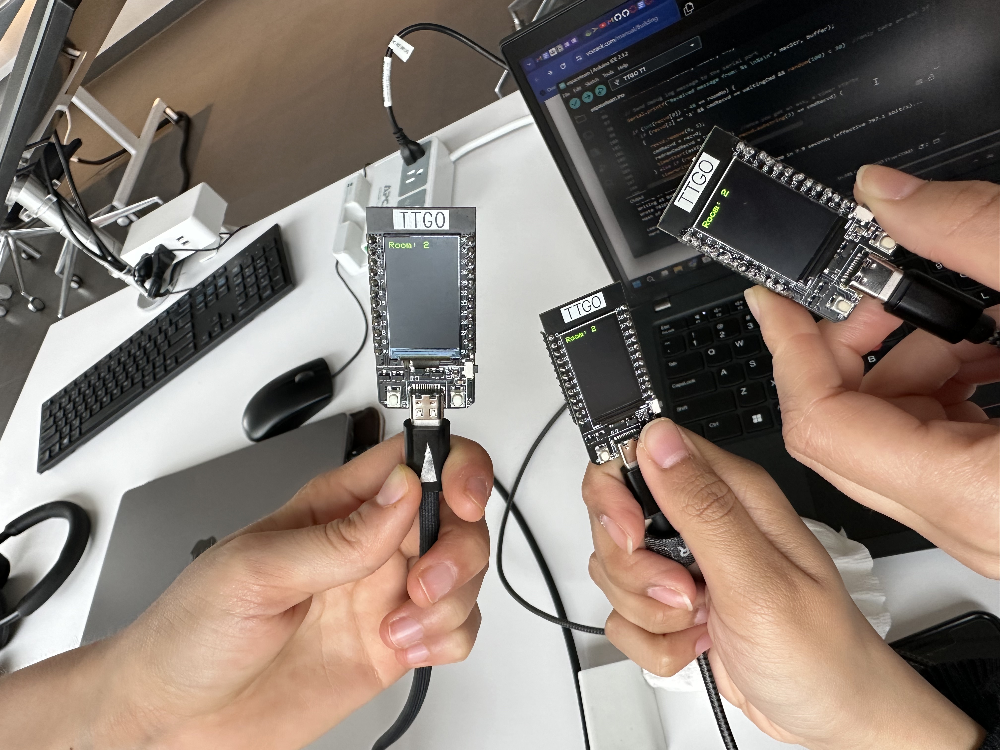

# ESP32aceTeam - Enhanced Edition
SpaceTeam for ESP32s

Designed by Eliana Shapere
https://docs.google.com/document/d/1vphklPqY_keQlNk1hVz_C3Pq45uIHXlx6fpNlm-N9_k/edit

## Overview
This enhanced version of the 'ESP32 Team!' game introduces dynamic gameplay with added levels and game room features, offering a more challenging and engaging experience for players. By incorporating levels, the game becomes progressively harder, demanding quicker responses and strategic thinking. The game rooms feature allows for a more organized and customized gameplay environment, enabling players to compete in smaller, random groups.

## Game Modification Details

### Levels
- Number of Levels: 3
- Game Speed Adjustment: The game's speed increases as players progress. Upon reaching 1/3 and 2/3 of the set goal, the game globally adjusts the speed between progress message sender and receivers.
- Implementation: In the updateGameSpeed() function, both askTime and expireLength are reduced by two-thirds upon each level progression, making the game more challenging.
- Error Checking: Added to ensure askTime and expireLength values do not drop below 1 second, maintaining the game's playability.

### Rooms
- Room Feature: 3 separate rooms are created to categorize players into distinct groups.
- Assignment Mechanism: Players are automatically and randomly assigned to one of the three rooms at the start, for an element of unpredictability within smaller groups.

## Setup Instructions
1. Flash the Game: Follow the instructions to flash the modified game onto your ESP32 device from this GitHub repository.
2. Power On: Once flashed, power on the ESP32 device. The device will automatically assign you to a game room.
3. Gameplay Begins: After room selection, the game starts automatically. Pay close attention to the instructions appearing on your ESP32 screen and respond as quickly as possible to progress.
4. Progressing Through Levels: Successful actions will contribute to your overall progress. Once the collective progress reaches certain thresholds (1/3 and 2/3 of the goal), the game will level up, increasing the difficulty through faster ask times and shorter expiry lengths. Notification of leveling up (the timer speeding up) is printed in the serial dialogue. If the gloabl progress decreases after reaching the level thresholds, the timer will slow down again to the previous level's timing.

## Gameplay Notes
- Collaboration is Key: While individual quick responses are crucial, the game's nature encourages teamwork and communication among players, especially within the same room.
- Strategic Play: As levels progress, strategic play becomes increasingly important. Players must balance speed with accuracy to avoid penalties and ensure collective advancement.
- Adaptability: The random assignment to game rooms and the dynamic difficulty adjustment demand adaptability from players, making each game experience unique.
- Enjoy the enhanced gameplay experience with added levels and game rooms, designed to challenge your speed, accuracy, and teamwork skills in a fun and interactive setting!
